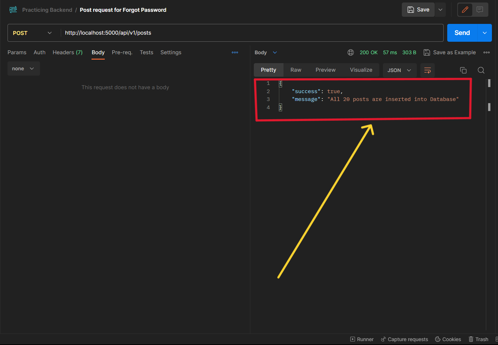
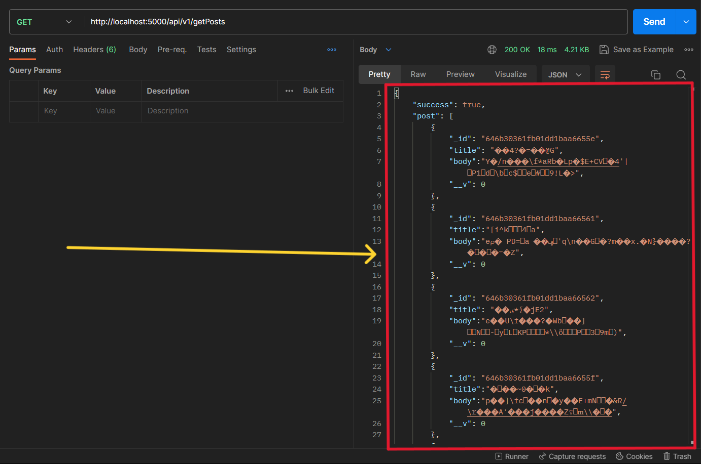
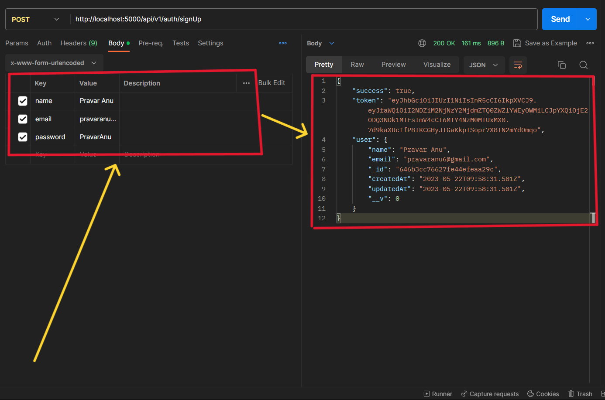
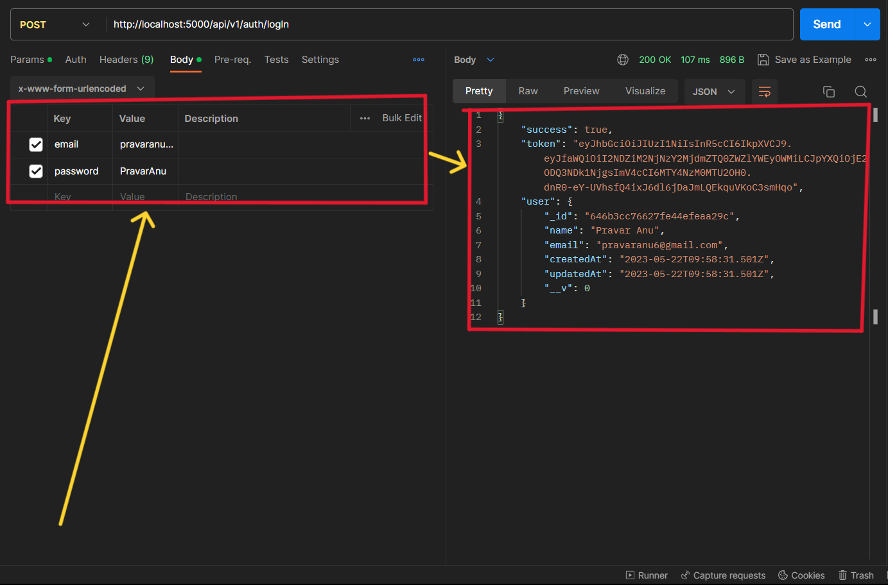
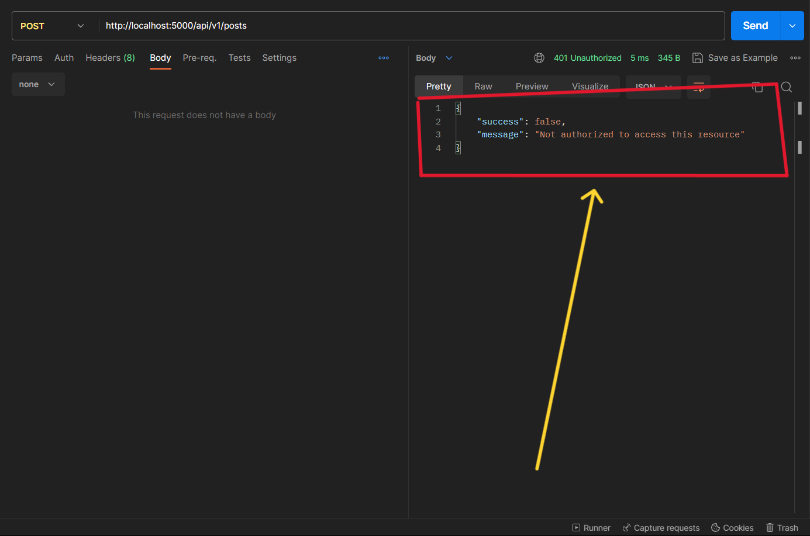
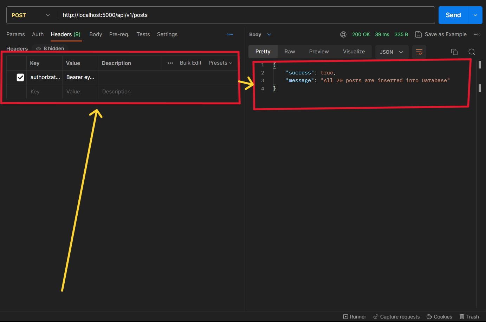

# Q1. Create a simple server using Express and connect with backend and create an endpoint “/post” which sends 20 posts.

# Q2. Explain a middleware and create a middleware that checks is user authenticated or not then send data of post.

### **Both the questions are implemented in the single project

## For Question 1:
-  Firstly, I created a folder and run a command `npm init`
- After that I have included some essential libraries
    - express - For creating a server
    - dotenv - For hiding secret/api keys
    - mongoose - For Database.
    - nodemon - For monitoring the changes in file during live running.
- After all the library added I have added a `index.js` file.
- Then I created a folder names `src` and in the src folder I created some more files and folder
    - config - Centrallized source for all secret/api keys
    - controllers - For all the methods like adding,deleteing,updating are implemented here
    - models - For schema related to the project are defined here
    - routes - For defining the routes for the project
    - services - For defining any service for the project which can be used anywhere in the file
    - utils - For defining any utility tool for the project which can be used anywhere in the file
    - app.js - For defining the App 

- After all of this I worte all the essential codes for this project.

### I have defined two routes -
- **/api/v1/posts** - This is a `POST` request which generate 20 random post with `title` and `body` using the crypto library and send it to databse for storing them.
    
- **/api/v1/getPosts** - This is a `GET` request which is used to get all posts from database.
    

## For Question 2:
- All the files/library used above in the question 1 remains same but some more are added
- Libraries added
    - bcryptjs - For encryption purpose
    - cookie-parser - For parsing cookie stored in browser
    - jsonwebtoken - For creating a token which is encrypted and has information of user and this token is stored as cookie
- Folders Added
    - middlewares - For writing all the middlewares

### For authorization I have defined two routes
- **api/v1/auth/signUp** - This is a `POST` request used for signing up a new user with name, email, password as value given through the body.

- **api/v1/auth/logIn** - This is a `POST` request used for logIn a user with email, password as value given through the body.

***In both the process of signIn and Login we generate a token using JWT which is stored in cookie for authorization during sending 20 posts to Database***

## Now Here is the solution for Question 2
- If a user is unauthrized to send 20 post then this error is returned

- If a user is authorized then he/she can send 20 posts to the database.

- All posts can be seen at `/api/v1/getPosts`
