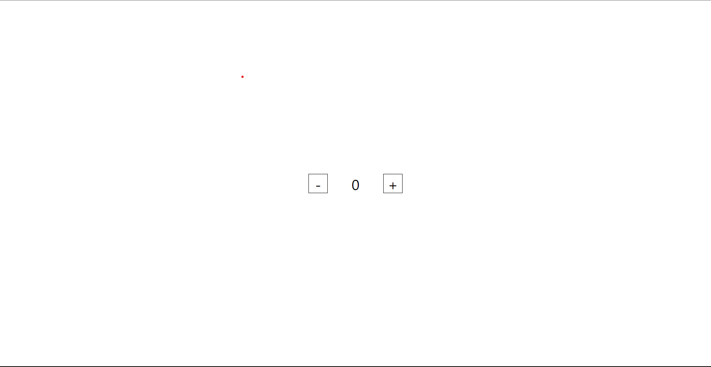

# Build A simple counter app using React

### In creation of this simple project I used useState() hook for record state of the counter variable

### The + button used for increasing the counter
### The - button is used for decreasing the counter

## Output
