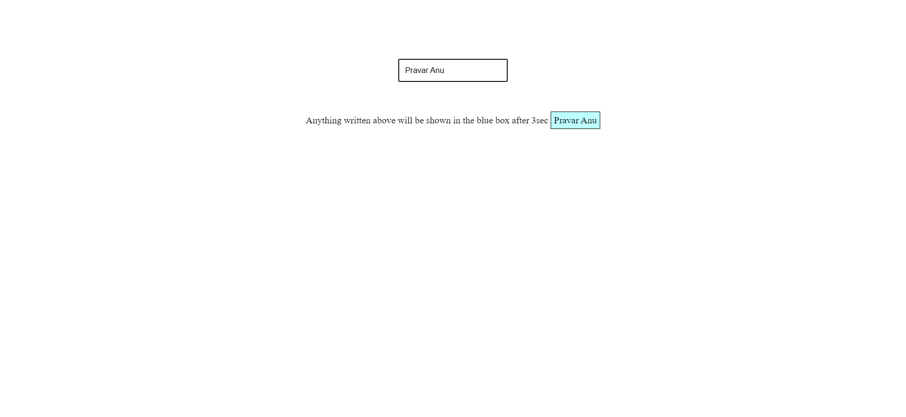

# Explain Debouncing and Create a project where you are using Debouncing 

### Debouncing in JavaScript refers to a technique used to handle repeated or rapid-fire events, such as keystrokes or scroll events, and ensure that a particular action is triggered only once after a certain delay, even if the event is fired multiple times within that delay. It helps optimize performance and prevent unnecessary or unintended actions.
 

## I made this project to understand debouncing through real implementation

- I have created a input field which takes input from the user
- After 3 sec of delay the things which are written inside the input field will be shown in the blue box

# Output
