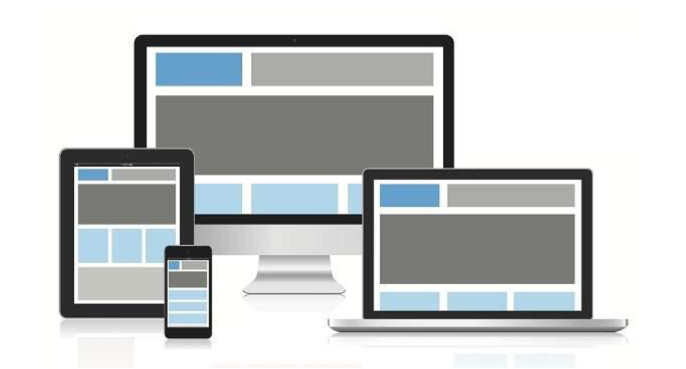
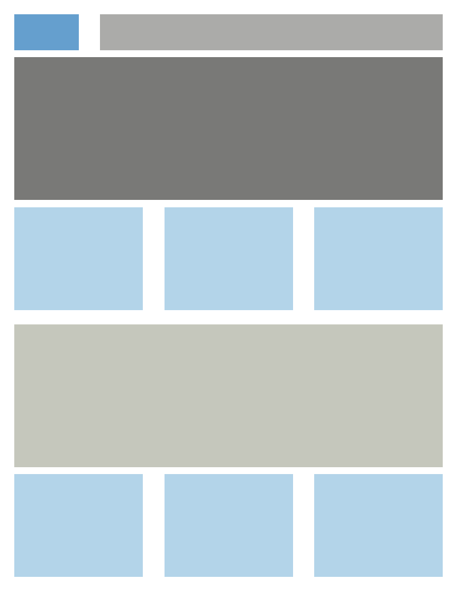
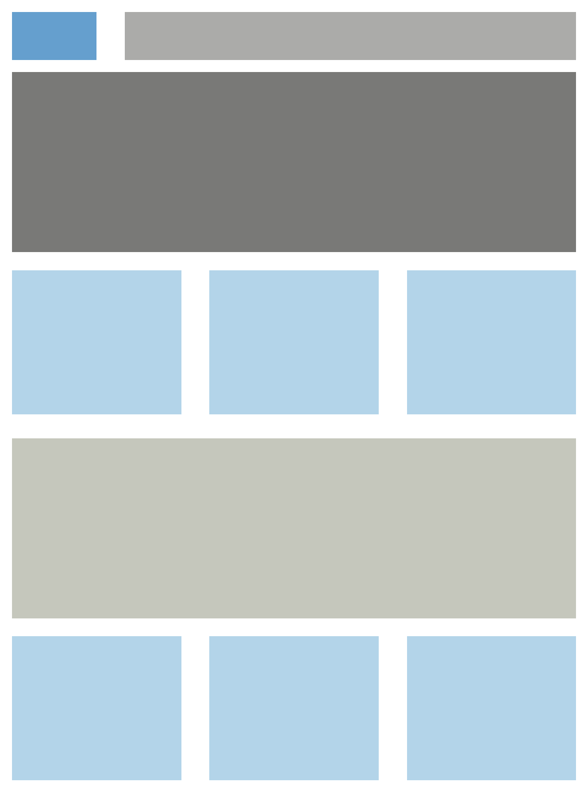

# Question: Build Responsive Layout both desktop and mobile and Tablet, see below image for reference.

---
### To achieve these layout I used
- flexbox

### I have created it for 3 screen size
1. Mobile (max-width: 360px)
2. Tablet (min-width:361px to max-width: 640px)
3. Laptop (min-width: 641px to max-width:1920 )

## These pages are designed using mobile first apporach which means Firstlt I created the page for mobile devices then I make the responsive for another devices

## OUTPUT
---
### For mobile

### For tablet

### For laptop

### For Desktop
